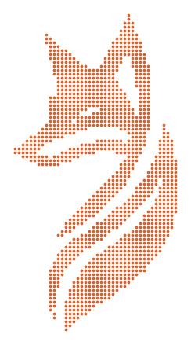

  

  

  
  
  

 

## › Sobre mim

Sou estudante de **Desenvolvimento de Software Multiplataforma** na **FATEC Prof. Jessen Vidal**, em São José dos Campos, com previsão de conclusão em 2028. Antes disso, fiz o técnico em Informática no **Colégio UNIVAP**, e foi lá que o interesse por desenvolvimento virou algo sério.

Na FATEC, faço parte da equipe **RubyFox** nos projetos de API, sempre em cima de problemas reais: do planejamento urbano com dados do IBGE até a organização de normas técnicas para uma empresa aeronáutica.

Também passei pela **Technolife Informática** como estagiário técnico, cuidando de manutenção e formatação de computadores. Foi onde aprendi a trabalhar em equipe de verdade e a pedir ajuda sem cerimônia.

- Certificações: Técnico em Informática (UNIVAP), Introdução ao SCRUM (FGV) e Escola de Inovadores (INOVA CPS)
- Idiomas: Português (nativo) e Inglês (avançado)

 

## › Tecnologias

<table>
  <tr>
    <td width="130"><b>Back-End</b></td>
    <td></td>
  </tr>
  <tr>
    <td><b>Front-End</b></td>
    <td></td>
  </tr>
  <tr>
    <td><b>Dados</b></td>
    <td></td>
  </tr>
  <tr>
    <td><b>Ferramentas</b></td>
    <td></td>
  </tr>
</table>

 

## › Destaques da FATEC

Projetos de API desenvolvidos com a equipe <b>RubyFox</b> ao longo do curso.

<table>
  <tr>
    <td width="50%" valign="top">
      
      <h3><a href="https://github.com/FATCK06/ProjectAPI_FirstSemester">Análise de Censo de São José dos Campos</a></h3>
      
Análise dos censos do IBGE de 2010 e 2022 para apoiar o planejamento urbano da cidade.

      
      
      
      
      
      
    </td>
    <td width="50%" valign="top">
      
      <h3><a href="https://github.com/FATCK06/ProjectAPI_SecondSemester">Plataforma de Normas Aeronáuticas</a></h3>
      
Proposta da AKAER: organizar as normas técnicas da empresa e deixar a busca mais rápida para a equipe.

      
      
      
      
    </td>
  </tr>
</table>

## › Outros projetos

<table>
  <tr>
    <td width="50%" valign="top">
      <h3><a href="https://github.com/viniciuslopes2/portfolio-final">Portfólio</a></h3>
      
Meu portfólio atual, feito com HTML, CSS e JavaScript puro, com painel administrativo para gerenciar projetos, certificações e experiências.

      
      
      
    </td>
    <td width="50%" valign="top">
      <h3><a href="https://github.com/viniciuslopes2/IHC-RubyFox">Assistente de Estoque</a></h3>
      
Bot de Telegram que responde perguntas sobre estoque em linguagem natural, por texto ou áudio. Ele transforma a pergunta em SQL com DSPy, valida a consulta e busca os dados em uma API FastAPI.

      
      
      
      
      
      
    </td>
  </tr>
</table>

 

## › Estatísticas

  
  

  

  

 

## › Troféus

  

 

## › Onde me encontrar

  
  
  

 

  

  

